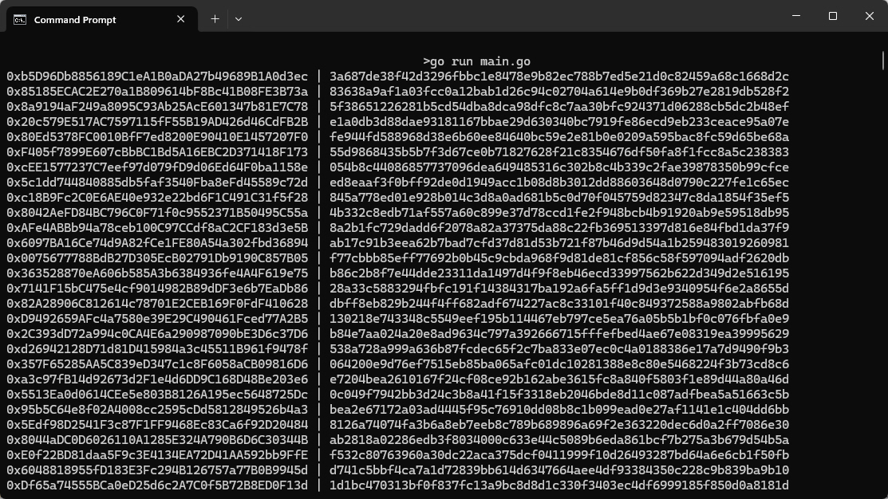

# Ethereum Address Generator
This is a fast, and concurrent Ethereum address generator written in Go. 
It generates Evm-compatible addresses using cryptographic operations.

## Features

- Generates Ethereum and Evm-compatible addresses concurrently.
- Saves generated addresses to output folder.
- Fast and efficient.



## Requirements

- Go 1.20 or higher.
- A stable internet connection to download dependencies.

## Run
### Install Dependencies 
```bash
go mod tidy
```

### Generate Addresses and Private keys 
```bash
go run main.go
```

## Developer
Alza Moh

### Contact me
alza@defifnt.digital

https://www.linkedin.com/in/alza-moh/

https://t.me/alzamoh

alza.mohh@gmail.com